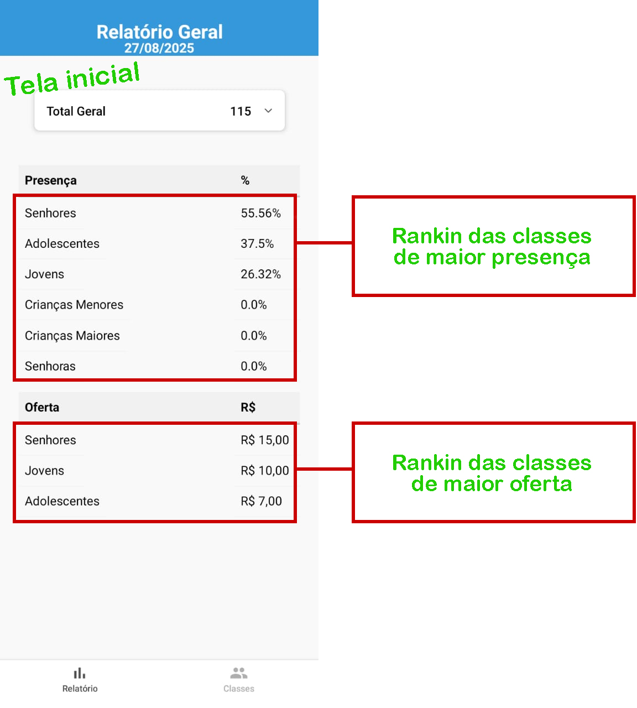
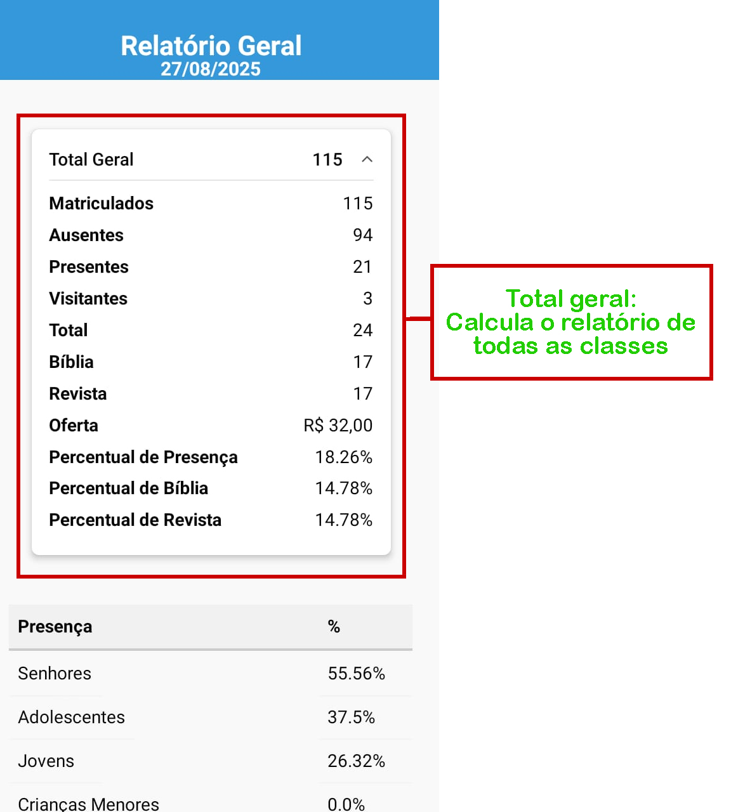
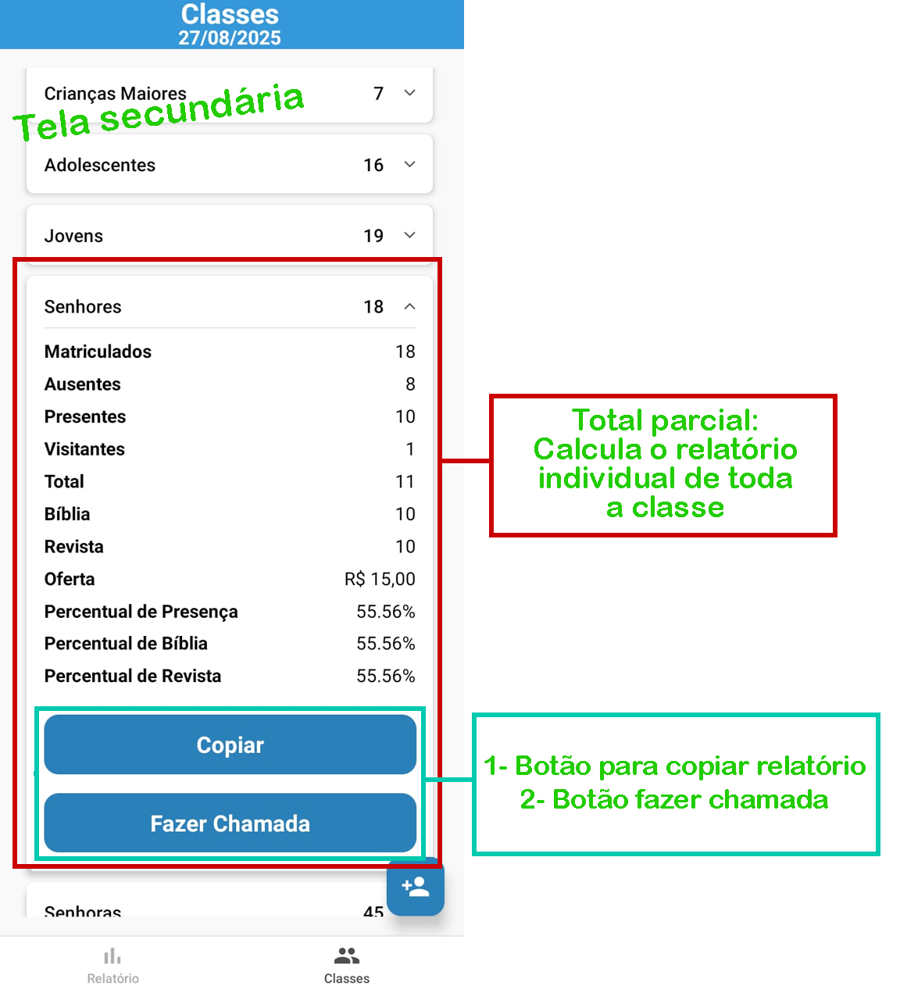
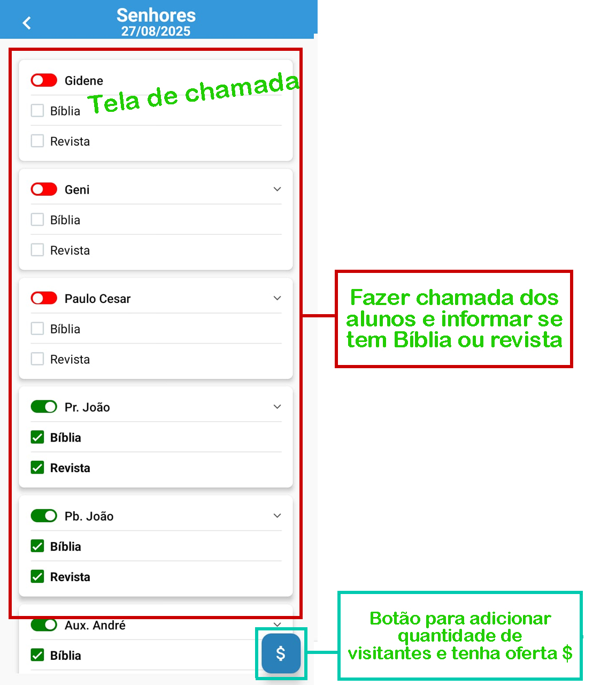

# 📖 Sistema EBD – Aplicativo para Escola Bíblica Dominical

- **Link para download do APK no android:**:
```bash
https://expo.dev/accounts/everton_lourens/projects/cadastro-classes/builds/efbd803c-4b57-4b3d-ade0-7a980ed040a1
```

Este repositório contém o desenvolvimento de um aplicativo criado com **Expo + React Native**, com o propósito de facilitar e otimizar a rotina da **Escola Bíblica Dominical (EBD)** da **Igreja Assembleia de Deus 2 de Julho**.

---

## 📌 Sobre o projeto

Durante os cultos de domingo, a igreja realiza a Escola Bíblica Dominical — um momento dedicado ao ensino bíblico. No entanto, a organização dessa atividade era feita de forma totalmente manual:

- Controle de presença dos alunos;
- Contagem de Bíblias e revistas;
- Registro de ofertas;
- Cálculo de porcentagens;
- Identificação da turma com melhor desempenho.

Esse processo exigia tempo e dedicação que poderiam ser direcionados ao ensino em si.

---

## 💡 Solução proposta

Pensando nessa necessidade, desenvolvi este aplicativo com foco em **facilidade**, **agilidade** e **precisão**.

### Com o app é possível:

✅ Cadastrar e remover alunos;  
✅ Fazer chamadas de forma intuitiva;  
✅ Registrar se o aluno trouxe Bíblia ou revista;  
✅ Calcular automaticamente presença, ausência e porcentagens;  
✅ Gerar um ranking das turmas com melhor desempenho;  
✅ Copiar relatórios prontos com um clique.

---

## 🧑‍💻 Tecnologias utilizadas

- [Expo](https://expo.dev/)
- [React Native](https://reactnative.dev/)
- [TypeScript](https://www.typescriptlang.org/)
- [Zustand](https://github.com/pmndrs/zustand)
- [SQLite](https://docs.expo.dev/versions/latest/sdk/sqlite/)
- Entre outras...

---

## 📷 Imagens do aplicativo

### Tela inicial  
Rankings de presença e oferta das turmas.  


---

### Tela inicial
Relatório geral somado de todas as turmas.  


---

### Tela de cadastro  
Cadastro de alunos.  
  

---

### Calculo parcial de cada classe 
Cada classe tem seu cálculo de presença, bíblia e revista etc.


---

## 🙌 Impacto social

Este projeto vai além do código. Ele representa o uso da **tecnologia a serviço das pessoas**, proporcionando:

- Eficiência no tempo dos professores;
- Clareza nos relatórios;
- Valorização do esforço dos alunos;
- Apoio à missão de ensino da igreja.

---

## 🤝 Contribuição e contato

Se você acredita que tecnologia e impacto social podem caminhar juntos, **vamos conversar!**

📧 Desenvolvedor: Everton Lourens  
🔗 GitHub: [https://github.com/Everton-Lourens/sistema-ebd](https://github.com/Everton-Lourens/sistema-ebd)

---

> ✨ Projeto com propósito. Usando a programação para transformar rotinas e servir melhor.
